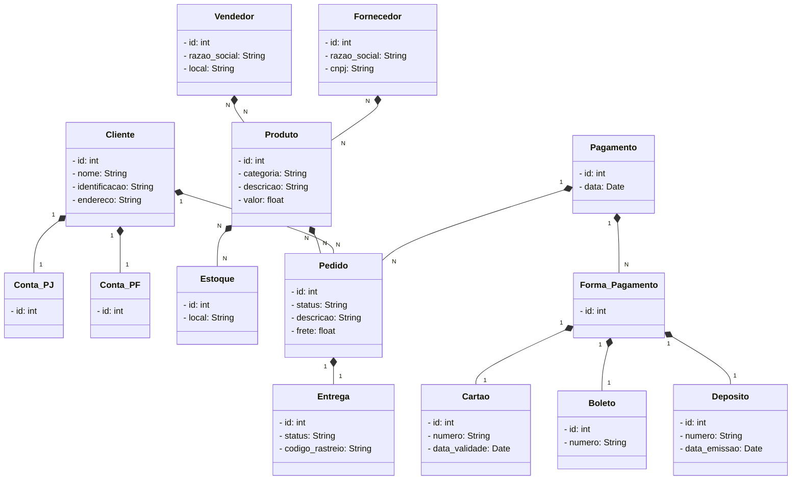

# Modelo Lógico E-commerce refinado

## Diagrama de Classes

```mermaid
classDiagram
    class Cliente {
        - id: int
        - nome: String
        - identificacao: String
        - endereco: String
    }

    class Conta_PJ {
        - id: int
    }

     class Conta_PF {
        - id: int
    }

    class Produto {
        - id: int
        - categoria: String
        - descricao: String
        - valor: float
    }

    class Vendedor {
        - id: int
        - razao_social: String
        - local: String
    }

    class Fornecedor {
        - id: int
        - razao_social: String
        - cnpj: String
    }

    class Estoque {
        - id: int
        - local: String
    }

    class Pedido {
        - id: int
        - status: String
        - descricao: String
        - frete: float
    }

    class Pagamento {
        - id: int
        - data: Date
    }

    class Forma_Pagamento {
        - id: int
    }

    class Cartao {
        - id: int
        - numero: String
        - data_validade: Date
    }

    class Boleto {
        - id: int
        - numero: String
    }

    class Deposito {
        - id: int
        - numero: String
        - data_emissao: Date
    }

    class Entrega {
        - id: int
        - status: String
        - codigo_rastreio: String
    }

    Vendedor "N" *-- "N" Produto
    Fornecedor "N" *-- "N" Produto
    Produto "N" *-- "N" Estoque
    Produto "N" *-- "N" Pedido
    Pedido "1" *-- "1" Entrega
    Cliente "1" *-- "N" Pedido
    Cliente "1" *-- "1" Conta_PJ
    Cliente "1" *-- "1" Conta_PF
    Pagamento "1" *-- "N" Pedido
    Pagamento "1" *-- "N" Forma_Pagamento
    Forma_Pagamento "1" *-- "1" Cartao
    Forma_Pagamento "1" *-- "1" Boleto
    Forma_Pagamento "1" *-- "1" Deposito
```
